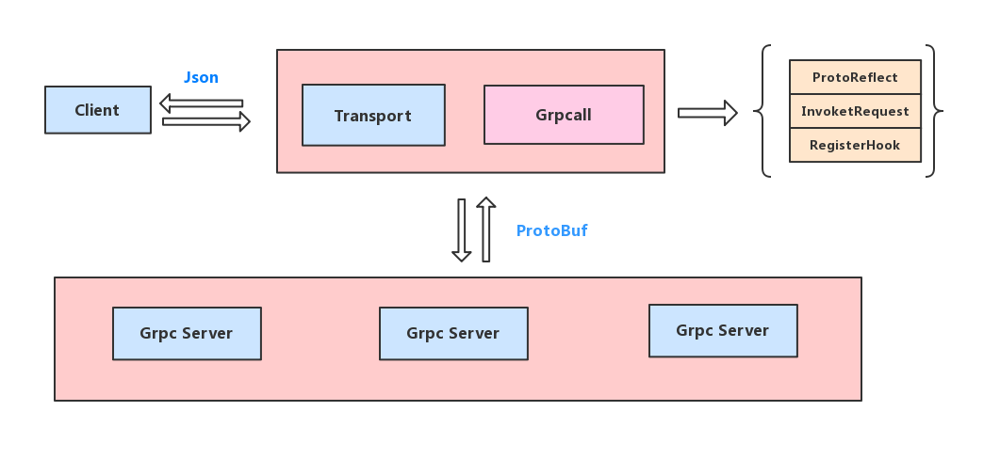

# grpcall

grpcall is a client library easy request GRPC Server with reflect mode, then it make grpc proxy mode middleware, like grpc-gateway.

use GRPC's reflect mode to request GRPC Server. grpcall support FileDescriptorSet and grpc/reflection mode.



`some code refer: protoreflect, grpcurl`

## Feature

* support event hook
* dynamic request GRPC Server with reflect mode. 
* dynamic convert protobuf to json and json to protobuf
* grpc client manager
* support stream
* recv system signal to update new descriptor.
* ...

## Usage

```go
grpcall.SetProtoSetFiles("helloworld.protoset")
grpcall.InitDescSource()

var handler = DefaultEventHandler{}
var sendBody string

grpcEnter, err := grpcall.New(
    grpcall.SetHookHandler(&handler),
)
grpcEnter.Init()

sendBody = `{"name": "xiaorui.cc"}`
res, err := grpcEnter.Call("127.0.0.1:50051", "helloworld.Greeter", "SayHello", sendBody)
fmt.Printf("%+v \n", res)
fmt.Println("req/reply return err: ", err)

sendBody = `{"msg": "hehe world"}`
res, err = grpcEnter.Call("127.0.0.1:50051", "helloworld.SimpleService", "SimpleRPC", sendBody)
fmt.Printf("%+v \n", res)
fmt.Println("stream return err: ", err)

wg := sync.WaitGroup{}
wg.Add(2)

go func() {
    defer wg.Done()
    for {
        body := fmt.Sprintf(`{"msg": "hehe world %s"}`, time.Now().String())
        select {
        case res.SendChan <- []byte(body):
            // fmt.Println("send", body)
            time.Sleep(3 * time.Second)

        case <-res.DoneChan:
            return

        default:
            return
        }
    }
}()

go func() {
    defer wg.Done()

    for {
        select {
        case msg, ok := <-res.ResultChan:
            fmt.Println("recv data:", msg, ok)
        case err := <-res.DoneChan:
            fmt.Println("done chan: ", err)
            return
        }
    }
}()

wg.Wait()

type DefaultEventHandler struct {
    sendChan chan []byte
}

func (h *DefaultEventHandler) OnReceiveData(md metadata.MD, resp string, respErr error) {
}

func (h *DefaultEventHandler) OnReceiveTrailers(stat *status.Status, md metadata.MD) {
}
```

## Test Example

1. start grpc server

```
cd testing; go run test_server.go
```

2. start grpcall client

```
cd testing; go run test_grpcall_client.go
```

## Protoset Files

Protoset files contain binary encoded `google.protobuf.FileDescriptorSet` protos. To create
a protoset file, invoke `protoc` with the `*.proto` files that define the service:

```shell
protoc --proto_path=. \
    --descriptor_set_out=myservice.protoset \
    --include_imports \
    my/custom/server/service.proto
```
